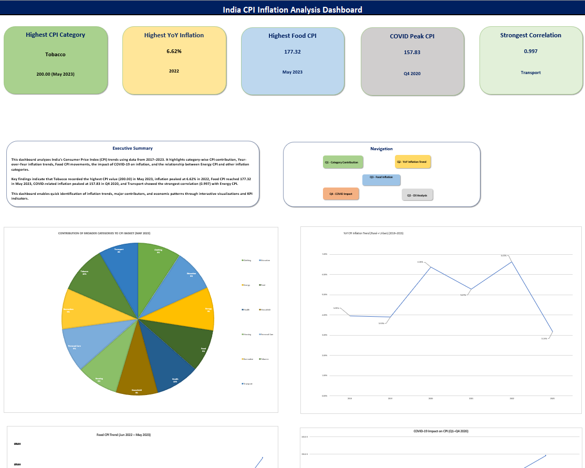
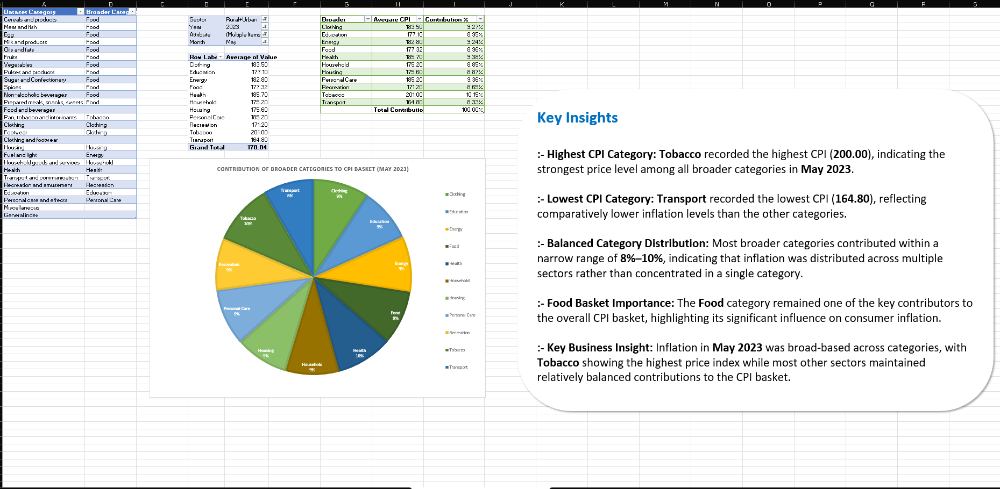
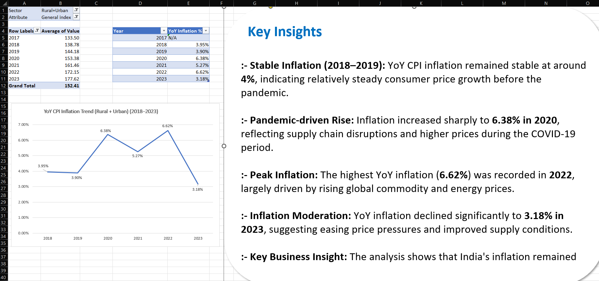
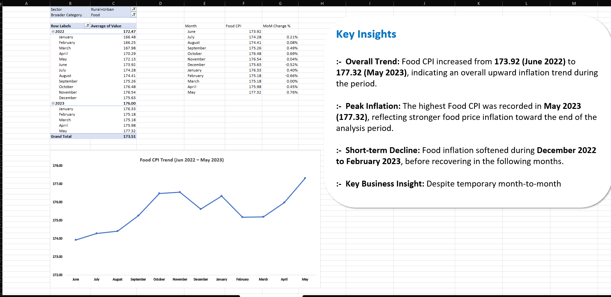
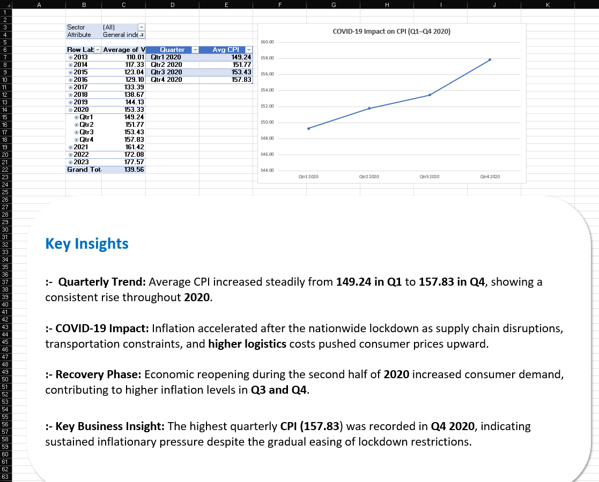
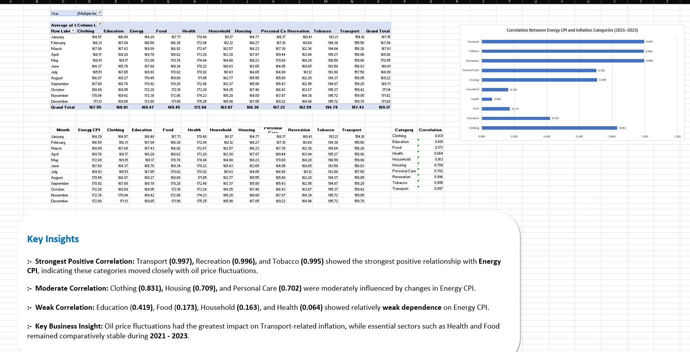

# 📊 India CPI Inflation Analysis Dashboard

An Excel-based Data Analytics project that analyzes India's Consumer Price Index (CPI) inflation trends using Microsoft Excel, Power Query, Pivot Tables, Pivot Charts, and an interactive Dashboard.

## 📌 Project Overview

This project analyzes India's Consumer Price Index (CPI) inflation trends using Microsoft Excel. The analysis includes category-wise inflation, Year-over-Year (YoY) trends, food inflation, COVID-19 impact, and the relationship between Energy CPI and other CPI categories.

An interactive dashboard was created to transform raw CPI data into meaningful business insights for data-driven decision-making.

## 📂 Dataset Information

- **Dataset:** All India Index_Upto_April23.csv
- **Source:** Government of India (GOI) CPI Dataset
- **Coverage:** January 2013 – April 2023
- **Sector:** Rural, Urban & General Index
- **Dataset Type:** Consumer Price Index (CPI) Index Values

- ## 🎯 Business Objective

The objective of this project is to analyze India's Consumer Price Index (CPI) data to:

- Identify inflation trends across different categories.
- Compare category-wise CPI contributions.
- Analyze Year-over-Year (YoY) inflation trends.
- Study food inflation patterns.
- Evaluate the impact of COVID-19 on CPI.
- Analyze the relationship between Energy CPI and other CPI categories.
- Present insights through an interactive Excel dashboard.

## 🛠️ Tools & Technologies

- Microsoft Excel
- Power Query
- Pivot Tables
- Pivot Charts
- Excel Formulas (AVERAGEIFS, COUNTIFS, SUMIFS, IF, etc.)
- Conditional Formatting
- Data Visualization
- Dashboard Design

## 🔄 Project Workflow

1. Data Collection
2. Data Cleaning using Power Query
3. Data Transformation
4. Data Analysis using Pivot Tables
5. Data Visualization using Pivot Charts
6. Dashboard Development
7. Business Insights & Recommendations

## 📈 Key Analysis Questions

This project answers the following business questions:

1. Which CPI category contributed the highest inflation in the latest period?
2. How has Year-over-Year (YoY) inflation changed over time?
3. What are the trends in Food Inflation across the analysis period?
4. What was the impact of COVID-19 on India's Consumer Price Index?
5. Which CPI category has the strongest relationship with Energy CPI?

## 💡 Key Findings

- **Tobacco** recorded the highest CPI value (**200.00**) in the latest analysis period.
- **Year-over-Year (YoY) inflation** peaked at **6.62% in 2022** before moderating in 2023.
- **Food CPI** showed an overall upward trend, reaching its highest value of **177.32** in May 2023.
- **COVID-19** significantly impacted inflation, with the highest quarterly CPI (**157.83**) recorded in **Q4 2020**.
- **Transport** showed the strongest positive correlation (**0.997**) with Energy CPI, indicating a close relationship between fuel prices and transportation costs.

## 📁 Project Structure

```text
India-CPI-Inflation-Analysis/
│
├── India_CPI_Inflation_Analysis_Akash.xlsx
├── README.md
│
├── 00_README
├── 01_Raw_Data
├── 02_Data_Cleaning
├── 03_Dashboard
├── 04_Q1_Category_Contribution
├── 05_Q2_YoY_Trend
├── 06_Q3_Food_Inflation
├── 07_Q4_COVID_Impact
└── 08_Q5_Oil_Analysis
```

## 🚀 Skills Demonstrated

- Data Cleaning
- Data Transformation
- Power Query
- Pivot Tables
- Pivot Charts
- Dashboard Design
- Business Analysis
- Data Visualization
- Microsoft Excel
- Analytical Thinking

## 👨‍💻 Author

**Akash Das**

- Aspiring Data Analyst
- B.Tech in Computer Science & Engineering
- Passionate about Data Analytics, Business Intelligence, SQL, Power BI, Python, and Machine Learning.

### Connect with Me

- LinkedIn: *(https://www.linkedin.com/in/akashdastech/)*
- GitHub: *(https://github.com/akhubdev)*

## 📸 Dashboard Preview

### Executive Dashboard



### Q1 – Category Contribution



### Q2 – Year-over-Year Inflation Trend



### Q3 – Food Inflation Trend



### Q4 – COVID-19 Impact Analysis



### Q5 – Energy CPI Correlation Analysis



## ⭐ Support

If you found this project helpful, consider giving it a ⭐ on GitHub.

## 🙏 Thank You

Thank you for visiting this repository.

If you have any suggestions or feedback, feel free to connect with me on LinkedIn or GitHub.
